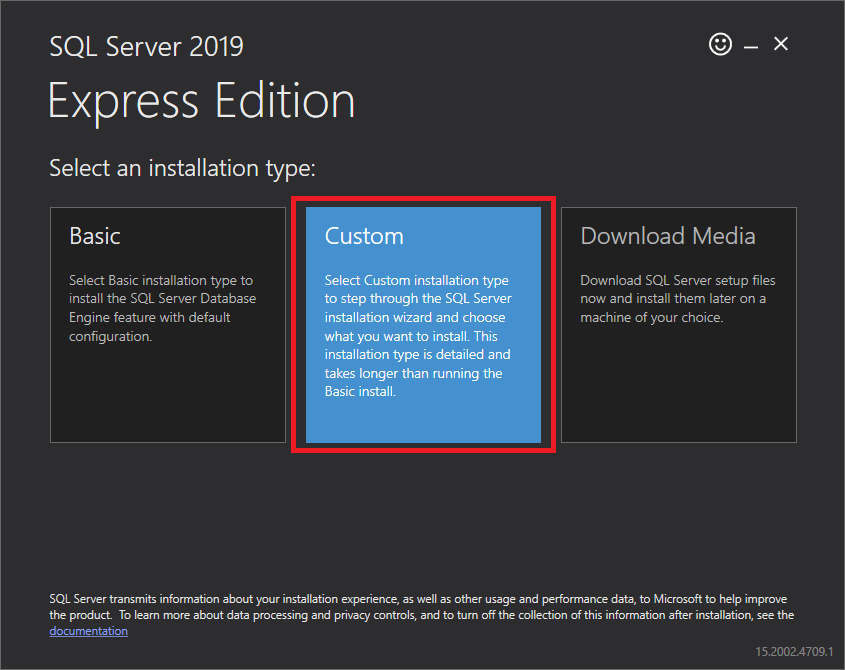

---
tags:
  - SQL
---

# Install Microsoft SQL Server 2019

> **Source:** [How to Install Microsoft SQL Server 2019 and SQL Server Management Studio](https://learnsql.com/blog/how-to-install-sql-server-2019-windows/)   
> **Author:** [Dorota Wdzięczna](https://learnsql.com/authors/dorota-wdzieczna)   
> **Publication Date:** 2021-03-26

Follow the steps below to install SQL Server 2019.

## Download the installation media

If installing Standard edition through Volume Licensing, you should be able to download the installation media with the Product Key embedded from [VLSC](https://www.microsoft.com/licensing/servicecenter/default.aspx). Otherwise, you can download *Express* edition from [here](https://www.microsoft.com/en-us/sql-server/sql-server-downloads).  Be aware of the limitations and ensure your use-case will support those imposed by the free version.

If installing from Microsoft, you should see something like the screenshot below.

Download the installation file and run it.  The installation wizard will appear.

Select Custom if you want to choose which components to install. You’ll need to specify the target location for the media download. If you want to change the default path, click the Browse button. Make sure you have enough disk space.

Click the *Install* button to download SQL Server 2019 Express’ installation packages:

Once the download is complete, you’ll get a message that everything was successful and that the installation is about to start.

Soon, you’ll see the *Installation Center* window. Choose *New SQL Server stand-alone installation*.

Check the box *I accept the license terms ...* and click the *Next* button.

The installation process will start by identifying any problems and seeing if there are any existing files to update:

If you only see warnings about the Windows firewall, you’re good to go. Click the *Next* button.

Now you can configure the server instance. Choose *Default instance* if available. Unless there is already a default installed or there is another compelling reason to specify an instance name, I will install a default instance.

If prompted to install Java, leave the default settings and click *Next*.

When that’s done, the server configuration will appear. If installing on a domain-joined PC, consider creating a domain *Service Account* for the *SQL Server Database Engine* service. Click the *Next* button once everything looks good:

In *Database Engine Configuration*, you can change the authentication mode to *Mixed*. This will allow you to log into the server using either Windows authentication or a SQL Server login. Most of our use-cases require *Mixed* mode authentication to allow other applications to connect to SQL Server remotely.

If prompted, accept, download, and install R and Python. They can be useful in MS SQL Server.

The installation will start.

When the installation process is complete, click Close.

## Install SQL Server Management Studio (SSMS)

To work even more effectively with MS SQL Server, I recommend that you use Microsoft SQL Server Management Studio (SSMS) or a similar tool. SSMS is used by many professionals around the world, and it’s available for free.

To do this, you must go back to the *SQL Server Installation Center*. This is where you chose the new stand-alone database installation.

Now, choose  *Install SQL Server Management Tools*. You will be taken to Microsoft's website, where you’ll find and download the latest version of Management Studio.

Run the downloaded *SSMS-Setup-ENU.exe* file and the installation process will begin. Click the *Install* button to start. (You can change the installation path by choosing another folder.)

Wait while packages are downloaded and installed.  When the installation is complete, you'll be asked to restart your computer.  Once restarted, open the Start menu and you'll see `Microsoft SQL Server 2019`, which contains `Microsoft SQL Server Management Studio`. Click on it to start using the application.

Launch the application and log in using *SQL Server Authentication* with the *sa* password you created during installation of the SQL Server instance or use *Windows Authentication* (assuming you added the current user/groups during initial install).
